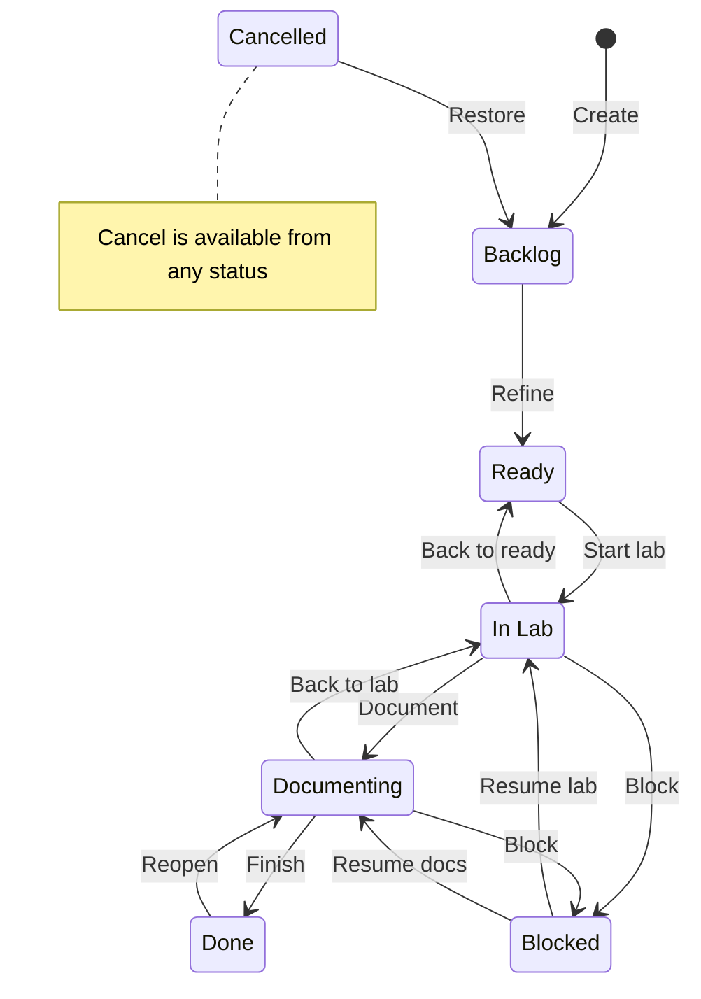

# Jira project

The lab is planned and tracked in Jira Cloud, project **`LNX` (Linux Admin Lab)**. The project doubles as Jira administration practice: each week adds one Jira skill alongside the Linux work.

## Setup

| Item | Value |
|---|---|
| Template | Scrum |
| Type | Company-managed (shared schemes, screens and field configurations) |
| Plan | Jira Free |
| Sprint length | 1 week |
| Estimation | Story points |

## Work types

A dedicated issue type scheme, `LNX: Issue Type Scheme`, keeps these changes away from the default scheme shared with other projects.

| Work type | Use |
|---|---|
| Epic | One per week of the roadmap (W00-W10) |
| Lab | Hands-on exercise on the lab VMs |
| Study | Reading, theory or exam objective review |
| Lab Issue | Something broke in the lab and needs troubleshooting |
| Task | Management and documentation work |
| Sub-task | Breakdown of any of the above |

## Workflow

All work types use **`LNX: Lab Workflow`** through the workflow scheme **`LNX: Workflow Scheme`** (used only by LNX), which also covers *All Unassigned Issue Types*, so new work types get it automatically.



Screenshot from the Jira workflow editor: [`jira/lab-workflow.png`](jira/lab-workflow.png).

### Statuses

| Status | Category | Meaning |
|---|---|---|
| Backlog | To Do | Captured, not refined yet |
| Ready | To Do | Refined and estimated, can be started |
| In Lab | In Progress | Hands-on work on the lab VMs |
| Documenting | In Progress | Writing the runbook or notes in this repository |
| Blocked | In Progress | Work started and stopped by an impediment |
| Done | Done | Lab done and documented |
| Cancelled | Done | Will not be done; kept for the audit trail |

The status **category** is what reports use (burndown, velocity, `statusCategory` in JQL), so the custom names do not break any report. The global `To Do` and `In Progress` statuses were left untouched because other projects on the site use them.

### Transitions and rules

| Transition | From | To | Rule (post-function) |
|---|---|---|---|
| Create | | Backlog | |
| Refine | Backlog | Ready | |
| Start lab | Ready | In Lab | |
| Back to ready | In Lab | Ready | |
| Document | In Lab | Documenting | |
| Back to lab | Documenting | In Lab | |
| Block | In Lab, Documenting | Blocked | Clear Resolution; shows `LNX: Block Screen` (asks for the blocked reason) |
| Resume lab | Blocked | In Lab | |
| Resume docs | Blocked | Documenting | |
| Finish | Documenting | Done | Resolution = Done |
| Reopen | Done | Documenting | Clear Resolution |
| Cancel | Any status | Cancelled | Resolution = Won't Do |
| Restore | Cancelled | Backlog | Clear Resolution |

The resolution is what Jira uses to decide whether a work item is open or closed (`resolution = Unresolved`). Every transition into a Done-category status sets it, and every transition out of one clears it.

### Board

| Column | Statuses |
|---|---|
| Backlog | Backlog |
| Ready | Ready |
| In Lab | In Lab |
| Documenting | Documenting |
| Blocked | Blocked |
| Done | Done, Cancelled |

Quick filters:

| Name | JQL |
|---|---|
| Hide cancelled | `status != Cancelled` |
| Blocked | `status = Blocked OR (issueLinkType = "is blocked by" AND statusCategory != Done)` |

## Custom fields and screens (W02, LNX-44)

Three custom fields record lab context on the work items, and separate screens decide where each one appears.

### Custom fields

| Field | Type | Purpose |
|---|---|---|
| `Lab VM` | Select list (multiple choices): `node1`, `node2`, `rhel9-template`, `rhel10-template` | Which VMs a lab touches |
| `Snapshot before` | Short text | Name of the snapshot taken before the lab, for rollback |
| `Blocked reason` | Paragraph | Why the work item is blocked |

All three keep Jira's default **global context**. Visibility is controlled by screens, not by contexts (see [Administration lessons](#administration-lessons)).

### Screens

| Screen | Fields | Used for |
|---|---|---|
| `LNX: Create Screen` | Summary, Parent, Description, Story Points, `Lab VM` (Work type is always shown by Jira) | Create |
| `LNX: Edit Screen` | Everything on `LNX: Scrum Default Issue Screen`, plus `Lab VM`, `Snapshot before`, `Blocked reason` at the end | Edit and View |
| `LNX: Block Screen` | `Blocked reason` (Jira adds the Comment box on transition screens) | *Block* transition |

`LNX: Edit Screen` is also the View screen, so existing work items keep all their data and the blocked reason stays visible on the item.

### Screen scheme and mapping

| Operation | Screen |
|---|---|
| Default | `LNX: Edit Screen` |
| Create | `LNX: Create Screen` |
| Edit | `LNX: Edit Screen` |
| View | `LNX: Edit Screen` |

This is **`LNX: Screen Scheme`**. In the work type screen scheme `LNX: Scrum Issue Type Screen Scheme` it is mapped to **Lab** and **Task**. Bug and Epic keep their own schemes, and the remaining work types (Lab Issue, Study, Sub-task) fall back to the Default row, `LNX: Scrum Default Screen Scheme`. Task therefore shows the lab fields too, empty.

The *Block* transition of `LNX: Lab Workflow` uses a **Show a screen** rule (inside the transition's rules panel, not a "Screen" setting) pointing to `LNX: Block Screen`.

### Resulting hierarchy

```
field -> context -> field scheme -> screen -> screen scheme -> work type screen scheme -> project
workflow transition -> screen (Show a screen rule)
```

### Test results (test item LNX-53, cancelled afterwards)

| Test | Result |
|---|---|
| Create a Lab | Dialog shows the work type, Summary, Description, Parent, Story Points and `Lab VM` (after the field scheme fix below) |
| Edit the item | `Snapshot before` and `Blocked reason` appear and save |
| Block from In Lab | Dialog asks for `Blocked reason` and a comment; the reason shows on the item |
| Existing item (LNX-47) | Description and Story Points still show |

Note: `Blocked reason` shows above the *Details* section, not inside it. Placement inside *Details* is controlled by the work type layout (Project settings > Work types > Lab > Layout), which was left unchanged.

## Jira skill roadmap

| Week | Jira skill |
|---|---|
| W00 | Issue type scheme, Scrum sprint, story points |
| W01 | Custom workflow and workflow scheme (`Backlog > Ready > In Lab > Documenting > Done`, plus `Blocked` and `Cancelled`) |
| W02 | Custom fields and separate create / edit / transition screens |
| W03 | Workflow conditions, validators and post-functions |
| W04 | Versions and release report |
| W05 | Automation rules |
| W06 | Jira forms (patch window checklist) |
| W07 | Advanced JQL, filters and dashboards |
| W08 | Components |
| W09 | Scheduled automation |
| W10 | Permission and notification schemes (needs a Standard plan trial) |

## Administration lessons

### Two story point fields

- **Symptom:** the backlog showed `-` for every estimate and the sprint total stayed at 0, although values were saved in the work items.
- **Cause:** the site has two fields, `Story point estimate` (`customfield_10016`, all work types) and `Story Points` (`customfield_10039`, only Epic and Story). The board estimates with `Story Points`, but the project had no Story work type, so the field was unavailable on Lab and Task.
- **Fix:** add a context for `Story Points` limited to project `LNX` and its work types, add the field to the project screen, and remove `Story point estimate` from that screen to avoid confusion.
- **Rule:** for a field to work on a work type it needs both a **context** that includes the work type and a place on the **screen**.

### Screen hierarchy

`Issue Type Screen Scheme` maps work types to a `Screen Scheme`, which maps operations (create, edit, view) to a `Screen`, which holds the fields. Epics use their own screen.

### Deleting work items on the Free plan

- **Symptom:** "You need permission from an admin first" when deleting a work item.
- **Cause:** the permission scheme grants *Delete Issues* to the project role Administrators, and on the Free plan project roles cannot be managed.
- **Approach:** do not delete. Close unwanted items with the `Cancel` transition, which sets the `Cancelled` status and a *Won't Do* resolution (see [Workflow](#workflow)). This also keeps the audit trail, which is common practice in production Jira sites.
- **Rule:** the permission scheme says which role gets a permission; the project says who is in each role.

### Making blockers visible

There are two kinds of blocker, and they are tracked differently:

- **Dependency:** the item cannot start until another one finishes. Record it with an *is blocked by* link and a **flag** on the blocked item; it stays in Backlog or Ready.
- **Impediment:** work already started and something stopped it. Move it to the `Blocked` status with the *Block* transition.

A link does not show on the board card, so the `Blocked` quick filter covers both:

```
status = Blocked OR (issueLinkType = "is blocked by" AND statusCategory != Done)
```

### Publishing a workflow scheme

- When a workflow scheme replaces statuses that work items are using, Jira asks to map every old status to a new one, **per work type**. In this site every dropdown defaulted to `Done`; accepting the defaults would have closed every open item. Check each mapping before clicking *Associate*.
- The migration itself is fast (4 seconds for about 40 work items).
- Workflows and schemes copied from Jira's defaults keep the description *"managed internally by Jira. Do not manually modify"*. Once customized, rewrite the name and description so they describe what the scheme really does.
- A workflow's **name cannot be changed while it is active** (used by a scheme that a project uses); only its description can. Choose the final workflow name before publishing. A workflow scheme can be renamed at any time.

### Board columns after a workflow change

- **Every status must be mapped to a column.** On a Scrum board, work items in an unmapped status disappear from the board **and** from the backlog.
- **The rightmost column is the "done" column.** Burndown and sprint completion count items in the last column. Moving `Done` to the left made `Blocked` the done column.
- Put `Done` and `Cancelled` in the same last column, and hide cancelled items with a quick filter instead of leaving the status unmapped.

### "Any status" transitions

A global transition (from *Any status*) is convenient but also applies to statuses where it makes no sense. The first version of *Block* came from any status, which allowed blocking a cancelled or finished item and clearing its resolution, making it count as open again. Limit global transitions to statuses where they apply (`Block` now only comes from *In Lab* and *Documenting*), and keep *Any status* only for exits such as *Cancel*. Also give every terminal status a way back (`Reopen`, `Restore`).

### Bulk changes

Bulk edits and moves (for example changing several items from Task to Lab) are done from the work item search with JQL, not from the backlog.

### Hiding custom fields: contexts no longer work (CHANGE-3019)

Jira Cloud no longer lets a custom field's global context be deleted or restricted to specific work types or projects (CHANGE-3019). Adding an LNX-only context would not have hidden the fields from other projects, so it was skipped on purpose. The three fields keep their global context and **screens control visibility**: they are only added to `LNX:` screens, so no other project shows them.

### A field on the screen can still be missing (field scheme)

- **Symptom:** `Lab VM` was on `LNX: Create Screen`, the screen was mapped correctly, and the context was global, yet the create dialog said the field "isn't present on the create screen".
- **Cause:** the field was not part of the project's **field scheme** (Settings > Work items > Field schemes > Default Field Scheme).
- **Fix:** add it there with **Add fields**.
- **Rule:** a field needs to be in the field scheme **and** on the screen. Check in this order when a field does not show: context, field scheme, screen, screen scheme mapping, then caching (Ctrl+F5).

### Work type is not a screen field

*Work type* does not appear in a screen's field list in Jira Cloud. The create dialog always shows it, so a "Create Screen" lists one field fewer than the dialog.

### Transition screens

In the new workflow editor, a transition's screen is set with the rule **Show a screen** (Rules panel, next to *Request input* and *Validate details*); there is no separate "Screen" setting. The transition only appears from the statuses it is defined for: *Block* is not offered from Backlog or Ready, so testing it means moving the item through *Refine*, *Start lab* and then *Block*.

### Copying screens

A copied screen keeps the name `Copy of ...` until it is renamed. Rename it right away: trimming fields from a copy that had already been renamed to `LNX: Edit Screen` left that screen without its inherited fields and meant building it again from a fresh copy of `LNX: Scrum Default Issue Screen`.
